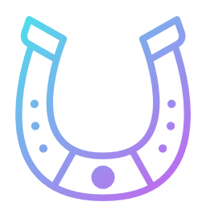

<p align="center">
  
</p>

<h1 align="center">Uma Night</h1>

<p align="center">
  Overlay oscuro y liviano para <b>Umamusume: Pretty Derby</b> (cliente de PC / Steam).<br>
  Oscurece los menús blancos sin tocar los archivos del juego.
</p>

> ⚠️ **Aviso:** este proyecto fue desarrollado con asistencia de IA (Claude, de Anthropic).

---

## Créditos: esto es un fork

Este proyecto es un **fork de [UmamusumeDarkMode](https://github.com/mayiflex/UmamusumeDarkMode) de [mayiflex](https://github.com/mayiflex)**. Todo el mérito de la idea original y de la base del código es suyo: el overlay que sigue la ventana del juego, el tinte que no bloquea los clics, el control de volumen, el silencio al perder el foco y la integración con la bandeja del sistema.

Sobre esa base, en este fork agregamos las mejoras que se describen abajo. El proyecto original se publicó bajo licencia MIT, y este fork mantiene la misma licencia.

## Descargo de responsabilidad

- Uma Night **no modifica archivos del juego, no inyecta código y no lee su memoria**. Solo dibuja una capa encima de la ventana, como cualquier otra ventana de Windows.
- **No se conecta a internet, no recopila datos y no incluye publicidad ni telemetría.** El código completo está en este repositorio.
- Aun así, **se provee "tal cual", sin garantías de ningún tipo.** Te recomendamos revisar el código por tu cuenta y analizar el ejecutable (por ejemplo, con [VirusTotal](https://www.virustotal.com)) antes de usarlo. Si podés, compilalo vos mismo desde el código.
- **No nos hacemos responsables** de problemas, virus en copias descargadas de otros sitios, pérdida de datos, sanciones en tu cuenta del juego ni ningún otro daño derivado del uso de este programa. Cualquier herramienta de terceros se usa bajo tu propia responsabilidad.

## Qué hace

### Funciones del original

- Tinte oscuro ajustable (0–90%) que sigue la ventana del juego en tiempo real y no bloquea los clics.
- Control del volumen del juego (vía Windows Core Audio).
- Silenciar el juego al cambiar a otra ventana.
- Icono en la bandeja del sistema e inicio automático con Windows.

### Mejoras de este fork

| Mejora | Qué hace |
| --- | --- |
| **Solo oscurecer laterales** | En modo horizontal, oscurece el menú de la derecha y el margen izquierdo, y deja la vista central del juego como está. |
| **Detección de pantalla completa** | En conciertos y carreras, donde el juego ocupa todo el ancho, detecta el cambio de layout y saca el tinte de los costados. Reconoce la columna de pestañas de la derecha (aunque aparezca atenuada) para no confundir las pantallas de carga con un concierto. |
| **Suavizar destellos** | Mide el brillo real del juego 10 veces por segundo y oscurece un poco más cuando aparece mucho blanco. Sube rápido y baja lento, así que el parpadeo del Log y de los fondos blancos queda amortiguado. Intensidad regulable. |
| **Nivel propio para el centro** | Un slider aparte para la zona del juego (por defecto 0%). En pantalla completa se aplica a todo. |
| **Color del tinte** | Negro, Gris cálido, Ámbar o Azul noche. |
| **Sigue activo al perder el foco** | Si hacés clic en otro monitor, el tinte se mantiene y no parpadea al volver al juego. Solo si ponés una ventana delante del juego se ubica debajo de ella para no oscurecerla. |
| **Barra en la bandeja** | La barra de control arranca oculta y se muestra u oculta desde el icono de la bandeja o con el botón "—". |
| **Atajos de teclado** | Ver la tabla de abajo. |
| **Instancia única** | Si se abre dos veces, la segunda copia se cierra sola. |
| **Interfaz en español** | |

### Atajos

| Atajo | Acción |
| --- | --- |
| `Ctrl+Alt+↑` / `Ctrl+Alt+↓` | Laterales ±5% |
| `Ctrl+Alt+Shift+↑` / `Ctrl+Alt+Shift+↓` | Centro ±5% |
| `Ctrl+Alt+D` | Activar o desactivar "solo laterales" |
| `Ctrl+Alt+H` | Pausar o reanudar el oscurecido |

## Cómo funciona por dentro

- **Laterales:** el overlay dibuja un rectángulo oscuro con un "agujero" donde está la vista del juego. La posición del agujero se define en porcentajes del tamaño de la ventana (`HoleLeftPct`, `HoleWidthPct`…), así que se puede calibrar desde la configuración.
- **Detección de pantalla completa:** cada 0,4 s se miran los dos bordes de la vista central. En el menú hay un corte vertical marcado entre el juego y los laterales; en un concierto la imagen sigue de largo. Para no confundirse con pantallas de carga, también compara la columna de pestañas de la derecha con una "huella" tomada en el menú (correlación normalizada, así tolera que aparezca atenuada) y mide qué tan uniformes son el centro y los costados. Necesita varias lecturas seguidas antes de cambiar de modo, para no parpadear.
- **Medir sin verse a sí mismo:** las ventanas del overlay se excluyen de las capturas de pantalla (`WDA_EXCLUDEFROMCAPTURE`). Así la app puede mirar el juego sin su propio tinte encima. Como efecto secundario, **el oscurecido no aparece en capturas ni en OBS/Discord**, aunque vos sí lo veas en el monitor.
- **Suavizado:** el brillo se mide sobre una captura reducida a 64×36 píxeles, y el nivel del tinte se acerca al objetivo con curvas exponenciales distintas para subir y para bajar.

## Instalación

### Compilar desde el código

Requisitos: Windows 10/11 y el [.NET 8 SDK](https://dotnet.microsoft.com/download/dotnet/8.0).

```powershell
git clone https://github.com/KevinBarriosDev/UmaNight.git
cd UmaNight
dotnet publish UmamusumeDarkMode\UmamusumeDarkMode.csproj -c Release -r win-x64 --self-contained false -p:PublishSingleFile=true -o "$env:LOCALAPPDATA\Programs\UmaNight"
```

El ejecutable queda en `%LocalAppData%\Programs\UmaNight\UmaNight.exe`. Se necesita el **.NET 8 Desktop Runtime** para ejecutarlo.

### Uso

1. Abrí `UmaNight.exe`. Queda en la bandeja del sistema.
2. Clic izquierdo en el icono para mostrar u ocultar la barra; clic derecho para el menú.
3. Clic derecho sobre la barra para ver todas las opciones.

## Configuración

Se guarda en `%LocalAppData%\UmaNight\settings.json`. Algunos valores que se pueden ajustar a mano (con la app cerrada):

| Clave | Para qué sirve |
| --- | --- |
| `HoleLeftPct`, `HoleWidthPct`, `HoleTopPct`, `HoleHeightPct` | Posición de la zona central sin oscurecer, en % de la ventana. Calibrado para 2560×1440. |
| `SplitEdgeThreshold` | Sensibilidad de la detección de pantalla completa (por defecto 0.12). |
| `SidebarMatchThreshold` | Similitud mínima (0–1) para reconocer la columna de pestañas (por defecto 0.5). |
| `UniformStdThreshold` | Umbral para considerar una pantalla "lisa", como una carga (por defecto 0.05). |
| `DebugDetect` | `true` para registrar las mediciones en `detect.log`. |

## Ideas y sugerencias

¿Tenés una idea, un ajuste o encontraste un problema? Abrí un [issue](https://github.com/KevinBarriosDev/UmaNight/issues) y lo vemos. También podés hacer tu propio fork y modificarlo como quieras.

## Licencia

MIT, igual que el [proyecto original](https://github.com/mayiflex/UmamusumeDarkMode).

- Copyright del código original: mayiflex.
- Modificaciones de este fork: Kevin Barrios.
- Créditos completos en [CREDITS.md](CREDITS.md).

Umamusume: Pretty Derby es marca de Cygames, Inc. Este proyecto no está afiliado ni respaldado por Cygames.
